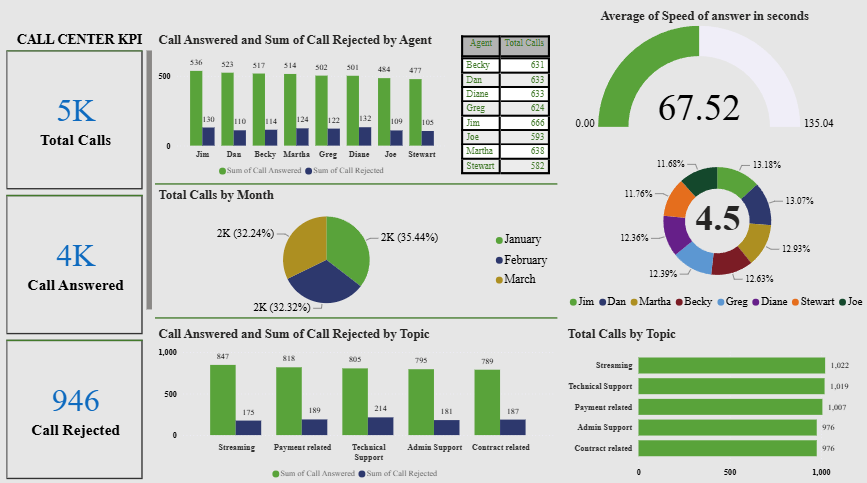

# Call Center Performance Dashboard

> An interactive Power BI dashboard tracking **5,000 inbound calls** — answer vs. reject rates, agent performance, speed of answer, customer satisfaction, and topic-level demand — to support staffing, SLA and service-quality decisions.




### 📥 Download
[**Power BI report (.pbix)**](Call%20Center%20Record%20Performance.pbix) — open in Power BI Desktop to explore the dashboard interactively.

---

## 📖 Overview

A single-page Power BI report that turns raw call-centre logs into an at-a-glance performance view for an operations manager: how many calls came in, how many were answered vs. rejected, how fast they were picked up, how satisfied callers were, and which agents and topics drove the volume.

---

## 🎯 Business Problem

- 📞 **No consolidated view** of call volume, answer rate and rejections.
- ⏱️ **Speed-of-answer blind spot** — is the team meeting response expectations?
- 👥 **Agent performance** — who's handling the most calls, and how well?
- 🗂️ **Topic demand** — which issue types generate the most (and most rejected) calls, so staffing can follow demand?

---

## 📊 Dashboard KPIs

| Metric | Value |
|---|---|
| **Total Calls** | **5,000** |
| **Calls Answered** | **4,000** (~81%) |
| **Calls Rejected** | **946** (~19%) |
| **Avg. Speed of Answer** | **67.52 sec** |
| **Avg. Satisfaction Rating** | **4.5 / 5** |

Interactive breakdowns by **agent**, **month**, and **call topic**, each split into calls answered vs. rejected.

---

## 💡 Key Insights

- **~81% answer rate** with **946 rejected calls** — the clearest SLA gap to close.
- **Speed of answer averages 67.5 seconds** (against a 0–135s range) — mid-range, with room to tighten toward faster pickup.
- **Satisfaction is high and stable (4.5/5)** and evenly distributed across all 8 agents — service *quality* isn't the problem; *capacity* is.
- **Volume is evenly spread** across agents (Jim highest at 666 total calls) and across January–March (~2K each), so rejections aren't caused by one weak agent or one spike month.
- **Streaming (1,022) and Technical Support (1,019) drive the most calls**, and **Technical Support carries the highest rejections (214)** — the prime candidate for added staffing or self-service deflection.

---

## 🛠️ Tech Stack

- **Power BI Desktop** — report design & interactivity
- **DAX** — measures for answer/reject totals, rates, average speed, and rating
- **Power Query** — data cleaning & shaping
- **Data modelling** — structured over the call-log table

---

## 🗃️ Dataset

Call-centre logs with fields for call ID, agent, date/month, topic, answered/rejected status, speed of answer (seconds), and satisfaction rating.

---

## 🧰 Skills Demonstrated

`Power BI` · `DAX measures` · `Power Query (ETL)` · `KPI design` · `Interactive dashboard design` · `Operations / performance analytics` · `SLA & service-level reporting` · `Data storytelling`

---

## 🗂️ Folder Structure

```
call-center-performance-dashboard-powerbi/
├── README.md
├── assets/
│   └── call_center_dashboard.png       # dashboard preview
├── Call Center Record Performance.pbix # Power BI report
└── LICENSE
```

---

## 🚀 Future Improvements

- **SLA targets** — add a speed-of-answer threshold with conditional formatting to flag breaches.
- **Trend view** — day/hour heatmap to expose peak-time understaffing.
- **Deflection analysis** — quantify how much self-service could reduce Technical Support volume.
- **Agent scorecards** — drill-through page per agent combining volume, speed and rating.

---

<p align="center">
  <strong>Abilash K S</strong> · Business & Data Analyst<br>
  <a href="https://portfolio-abilash-ks.vercel.app/">Portfolio</a> ·
  <a href="https://www.linkedin.com/in/abilash-k-s/">LinkedIn</a> ·
  <a href="mailto:abilash.connect@zohomail.in">Email</a>
</p>
